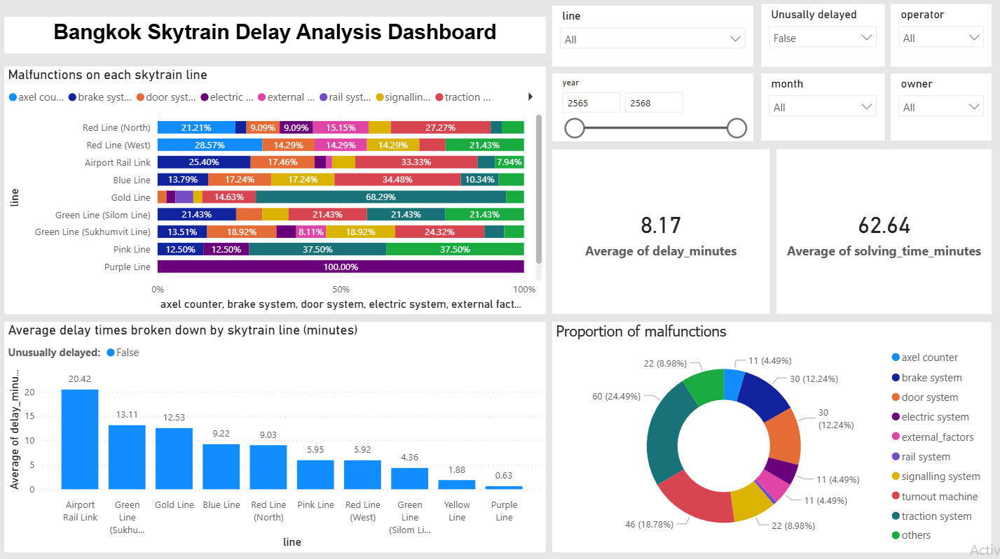

# Bangkok Skytrain Delay Analysis
โปรเจกต์วิเคราะห์เหตุการณ์ขัดข้องของรถไฟฟ้าในกรุงเทพฯ เพื่อหาความล่าช้าที่ผิดปกติและสาเหตุเชิงลึกของความล่าช้า

## Project Overview
โปรเจกต์นี้นำข้อมูลเหตุขัดข้องของรถไฟฟ้ามาทำการวิเคราะห์ทางสถิติ เพื่อแยกระหว่างเหตุขัดข้องทั่วไป และ เหตุขัดข้องที่รุนแรง โดยหาสาเหตุที่เกิดขึ้นว่ามาจากระบบใด

## เครื่องมือที่ใช้
- Python (Pandas, NumPy, Matplotlib, Seaborn)
- Statistical Analysis
- Power BI

## Key Insights
- สำหรับเหตุขัดข้องรุนแรงระบบขับเคลื่อน (Traction System) เป็นสาเหตุที่พบบ่อยที่สุด
- เวลาที่รถไฟฟ้าล่าช้าโดยเฉลี่ยในสถานการณ์ปกติอยู่ที่ประมาณไม่ถึงหนึ่่งนาทีจนถึงประมาณยี่สิบนาที แต่เวลาที่รถไฟฟ้าล่าช้าโดยเฉลี่ยจากการพบเหตุขัดข้องรุนแรงพบว่าอยู่ที่ประมาณหนึ่งชั่วโมงจนถึงหกชั่วโมงซึ่งแตกต่างกันหลายเท่า
- Airport Rail Link มีความเสี่ยงที่จะเกิดเหตุขัดข้องบ่อยกว่ารถไฟฟ้าสายอื่น

## Dashboard

## วิธีใช้งาน
1. เข้าโฟลเดอร์ `notebook/` เพื่อดูขั้นตอนการทำ Data Cleaning/ Handling Outliers และการวิเคราะห์ทางสถิติ
2. เข้าโฟลเดอร์ `dashboard/` เปิดไฟล์ `.pbix` ผ่าน Power BI เพื่อใช้งาน Dashboard