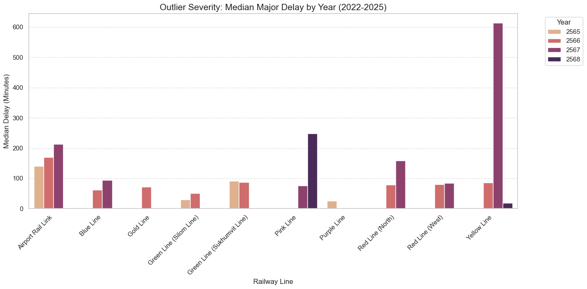

# Bangkok Sky Train & Metro Disruption/Delay Analysis
วิเคราะห์ความล่าช้าของรถไฟฟ้าแต่ละสายในสถานการณ์ปกติและสถานการณ์ที่พบปัญหาขัดข้องรุนแรง รวมถึงสาเหตุที่ทำให้เกิดความล่าช้า โดยเป็นข้อมูลสถิติตั้งแต่เดือนมิถุนายน 2565  ถึง กันยายน 2568
โดยจะแบ่งการวิเคราะห์ 3 แบบ
1. ความล่าช้าในสถานการณ์ปกติของรถไฟฟ้าแต่ละสาย ในแต่ละเดือน ตั้งแต่ปี 2565 ถึงปี 2568
2. ความล่าช้าในสถานการณ์ปกติของรถไฟฟ้าแต่ละสาย ตั้งแแต่ปี 2565 ถึงปี 2568
3. ความล่าช้าในสถานการณ์ผิดปกติหรือเกิดเหตุขัดข้องรุนแรงของรถไฟฟ้าแต่ละสาย ในแต่ละปี

## เครื่องมือที่ใช้
- Python (Pandas, Matplotlib, Seaborn)
- Statistical Analysis

## Key Insights
1. ความล่าช้าในสถานการณ์ปกติของรถไฟฟ้าแต่ละสาย ในแต่ละเดือน ตั้งแต่ปี 2565 ถึงปี 2568

จากกราฟ Heatmap แสดงค่ามัธยฐานความล่าช้าแยกตามเดือนในสถานการณ์ปกติ รวมตั้งแต่ปี 2565 ถึงปี 2568 แสดงความเชื่อมโยงระหว่างช่วงเวลากับประสิทธิภาพการเดินรถ และการวิเคราะห์สาเหตุหลักของรถไฟฟ้าบางสายที่มีความล่าช้าแต่ละเดือนมากพบว่า:
- รถไฟฟ้า Airport Rail Link มีค่ามัธยฐานของความล่าช้าสูงมากในเดือนมกราคม มีนาคม เมษายน พฤษภาคม กรกฎาคมและตุลาคม ซึ่งค่ามัธยฐานบ่งบอกกว่ามีโอกาสกว่า 50% ที่ผู้โดยสารจะเจอความล่าช้าน้อยกว่าค่าที่กำหนด และโอกาสอีก 50% ที่ผู้โดยสารจะเจอความล่าช้ามากกว่าค่าที่กำหนด
    - เดือนมกราคม มีค่ามัธยฐานความล่าช้าอยู่ที่ 52 นาที เหตุขัดข้อง 3 อันดับแรกที่เกิดคือ:
        - ระบบขับเคลื่อนของรถไฟฟ้า 7 ครั้ง คิดเป็น 58.3% 
        - ระบบเบรก 3 ครั้ง คิดเป็น 25% 
        - ระบบประตู 1 ครั้ง คิดเป็น 8.3 %
    - เดือนมีนาคม มีค่ามัธยฐานความล่าช้าอยู่ที่ 30 นาที เหตุขัดข้อง 3 อันดับแรกที่เกิดคือ:
        - ระบบขับเคลื่อนของรถไฟฟ้า 6 ครั้ง คิดเป็น 46.2% 
        - จุดสับราง 2 ครั้ง คิดเป็น 15.4% 
        - ระบบที่ใช้ควบคุมการเดินรถ 2 ครั้ง คิดเป็น 15.4%
    - เดือนเมษายน มีค่ามัธยฐานความล่าช้าอยู่ที่ 33 นาที เหตุขัดข้อง 3 อันดับแรกที่เกิดคือ:
        - ระบบขับเคลื่อนของรถไฟฟ้า 4 ครั้ง คิดเป็น 57.1% 
        - เหตุขัดข้องอื่น ๆ 2 ครั้ง คิดเป็น 28.6% 
        - ระบบเบรก 1 ครั้ง คิดเป็น 14.3%
    - เดือนพฤษภาคม มีค่ามัธยฐานความล่าช้าอยู่ที่ 45 นาที เหตุขัดข้อง 3 อันดับแรกที่เกิดคือ:
        - ระบบขับเคลื่อนของรถไฟฟ้า 5 ครั้ง คิดเป็น 41.7% 
        - ระบบเบรก 5 ครั้ง คิดเป็น 41.7% 
        - ระบบประตู 1 ครั้ง คิดเป็น 8.3%
    - เดือนกรกฎาคม มีค่ามัธยฐานความล่าช้าอยู่ที่ 83 นาที เหตุขัดข้อง 3 อันดับแรกที่เกิดคือ:
        - ระบบเบรก 7 ครั้ง คิดเป็น 50% 
        - จุดสับราง 2 ครั้ง คิดเป็น 14.3% 
        - ระบบขับเคลื่อน 1 ครั้ง คิดเป็น 7.1%
    - เดือนตุลาคม มีค่ามัธยฐานความล่าช้าอยู่ที่ 79 นาที เหตุขัดข้อง 3 อันดับแรกที่เกิดคือ:
        - ระบบขับเคลื่อน 3 ครั้ง คิดเป็น 25% 
        - ระบบเบรก 3 ครั้ง คิดเป็น 25% 
        - ระบบที่ใช้ควบคุมการเดินรถ 3 ครั้ง คิดเป็น 25%
- รถไฟฟ้าสายสีเขียว(สุขุมวิท) มีค่ามัธยฐานของความล่าช้าสูงมากในเดือนกันยายน ซึ่งค่ามัธยฐานบ่งบอกกว่ามีโอกาสกว่า 50% ที่ผู้โดยสารจะเจอความล่าช้าน้อยกว่าค่าที่กำหนด และโอกาสอีก 50% ที่ผู้โดยสารจะเจอความล่าช้ามากกว่าค่าที่กำหนด
    - เดือนกันยายน มีค่ามัธยฐานความล่าช้าอยู่ที่ 41 นาที เหตุขัดข้อง 3 อันดับแรกที่เกิดคือ:
        - ระบบประตู 2 ครั้ง คิดเป็น 33.3% 
        - ระบบขับเคลื่อน 1 ครั้ง คิดเป็น 16.7% 
        - ระบบไฟฟ้า 1 ครั้ง คิดเป็น 16.7%

จากการวิเคราะห์สาเหตุของเหตุขัดข้องที่นำไปสู่ระยะเวลาล่าช้าที่มากนั้นพบว่า รถไฟฟ้า Airport Rail Link พบว่า
- ระบบขับเคลื่อนมีปัญหา 26 ครั้ง 
- ระบบเบรกมีปัญหา 19 ครั้ง 
ซึ่งเป็นสาเหตุอันดับ 1 และ 2 ที่ทำให้เกิดความล่าช้ามาก 

จึงอาจต้องมีการตรวจสอบบริเวณสองระบบนี้อย่างดีเป็นพิเศษ

2. ความล่าช้าในสถานการณ์ปกติของรถไฟฟ้าแต่ละสาย ตั้งแแต่ปี 2565 ถึงปี 2568

จากกราฟแสดงแสดงค่ามัธยฐานของความล่าช้าสะสมรายปีของรถไฟฟ้าแต่ละสายในสถานการณ์ปกติตั้งแต่เดือนมิถุนายน ปี 2565 ถึง เดือนกันยายน ปี 2568 
- รถไฟฟ้าสายสีน้ำเงิน, สายสีเขียว(สีลม), สายสีชมพู, สายสีม่วง, สายสีแดง(เหนือ), สายสีแดง(ตะวันตก) และสายสีเหลือง เป็นสายที่เวลาของรถไฟฟ้ามีความเสถียรที่สุด โดยเหตุขัดข้องส่วนใหญ่ที่เกิดขึ้นถูกแก้ไขได้เร็วทำให้ไม่กระทบต่อเวลาการเดินรถของคนส่วนใหญ่
- รถไฟฟ้าสายสีเขียว (สุขุมวิท) และสายสีทองมีค่ามัธยฐานของความล่าช้าสะสมรายปีอยู่ที่ 11 นาทีแสดงว่าผู้โดยสารมีโอกาส 50% ที่จะเจอความล่าช้ามากกว่าหรือน้อยกว่า 11 นาที 
- รถไฟฟ้า Airport Rail Link มีค่ามัธยฐานความล่าช้าสูงที่สุด นั้นคือ 25 นาที แสดงว่าผู้โดยสารมีโอกาสเจอความล่าช้าเกือบครึ่งชั่วโมงเป็นเรื่องปกติ แม้ในวันที่ไม่มีเหตุขัดข้องรุนแรง

จากข้อมูลระบบที่ขัดข้องบ่อยที่สุดรายปี แยกแต่ละสายพบว่า:
- Airport Rail Link มีปัญหาที่ระบบขับเคลื่อน 3 ปีติดต่อกัน ตั้งแต่ 2565 - 2567 และจำนวนครั้งเพิ่มขึ้นเรื่อย ๆ โดยที่:
    - ปี 2565 เกิดปัญหา 8 ครั้ง
    - ปี 2566 เกิดปัญหา 12 ครั้ง
    - ปี 2567 เกิดปัญหา 19 ครั้ง
    แต่ในปี 2568 พบว่าปัญหาที่เกิดบ่อยสุดคือระบบเบรกเกิดปัญหาทั้งหมด 4 ครั้ง
- สายสีทองมีปัญหาที่จุดสับรางต่อเนื่องและรุนแรง โดยที่:
    - ปี 2566 เกิดปัญหา 11 ครั้ง
    - ปี 2567 เกิดปัญหา 8 ครั้ง
    - ปี 2568 เกิดปัญหา 8 ครั้ง

3. ความล่าช้าในสถานการณ์ผิดปกติหรือเกิดเหตุขัดข้องรุนแรงของรถไฟฟ้าแต่ละสาย ในแต่ละปี

จากกราฟแสดงค่ามัธยฐานความล่าช้าที่มากผิดปกติ (outliers) รายปี แยกตามสายรถไฟฟ้า ในที่นี้ outliers หมายถึงเหตุการณ์ขัดข้องรุนแรงที่ทำให้เกิดความล่าช้าสูงเกินกว่าปกติ  ข้อมูลนี้เป็นสถิติถึงเดือนกันยายนปี 2568 โดยจากกราฟจะเห็นว่า
- รถไฟฟ้าสายสีม่วงมีการจัดการกับปัญหาได้ดีเนื่องจากพบว่ามีการเกิดเหตุขัดข้องรุนแรงขึ้นในปี 2565 แล้วหลังจากนั้นไม่มีเหตุการณ์ขัดข้องรุนแรงเกิดขึ้นอีกเลย
- รถไฟฟ้าสายสีเหลืองมีเหตุขัดข้องรุนแรงในปี 2567 ที่ทำให้เวลาล่าช้าพุ่งสูงถึงประมาณ 613.5 นาที หรือประมาณ 10 ชั่วโมง ซึ่งต่อมาในปี 2568 พบว่าเหตุขัดข้องรุนแรงที่ทำให้เกิดความล่าช้ามากผิดปกติเหลือแค่ 19 นาทีโดยประมาณแสดงให้เห็นถึงการรับมือกับปัญหาที่ดีมากขึ้น
- รถไฟฟ้าสายสีทอง สายสีเขียว(สุขุมวิทและสีลม) พบว่าเกิดเหตุขัดข้องรุนแรงครั้งสุดท้ายคือปี 2566 แล้วไม่เกิดขึ้นอีกเลยหลังจากนั้น ซึ่งก็แสดงให้เห็นถึงการปรับปรุงระบบรางและตัวรถได้ดีขึ้น
- รถไฟฟ้า Airport Link พบว่าในปี 2565-2567 มีเหตุการขัดข้องรุนแรงเกิดขึ้นทุกปีและทำให้เกิดปัญหาความล่าช้าที่มากผิดปกติมากขึ้นทุกปีแสดงให้เห็นถึงการจัดการปัญหาที่ยังไม่ดีพอ 

จากข้อมูลระบบที่เป็นสาเหตุหลักที่ทำให้รถไฟฟ้าเกิดการความล่าช้าแบบผิดปกติพบว่า:
- รถไฟฟ้า Airport Rail Link และ รถไฟฟ้าสายสีเขียว (สีลม) มีปัญหาหลักที่ระบบขับเคลื่อน โดยเฉพาะ Airport Rail Link มีปัญหาที่ระบบขับเคลื่อน 6 ครั้ง แสดงให้เห็นว่าเมื่อเกิดเหตุขัดข้องที่ระบบขับเคลื่อนที่ใช้เวลาในการแก้ปัญหานาน ส่งผลให้เกิดความล่าช้าสะสมสูง
- รถไฟฟ้าสายสีม่วงมีปัญหาที่ระบบไฟฟ้าทำให้เกิดความล่าช้ามาก
- รถไฟฟ้าสายสีน้ำเงิน, สายสีแดง(เหนือ), สายสีเหลือง, สายสีทองและสายสีชมพู พบว่ามีปัญหาที่จุดสับรางเยอะที่สุดจนเป็นต้นเหตุให้เกิดความล่าช้าที่ผิดปกติ
- รถไฟฟ้าสายสีเขียว (สุขุมวิท) มีปัญหาที่ระบบประตู 3 ครั้ง จนเป็นเหตุให้เกิดความล่าช้าที่ผิดปกติมากที่สุด
- รถไฟฟ้าสายสีแดง (ตะวันตก) มีปัญหาที่ระบบเครื่องนับเพลา 4 ครั้ง ซึ่งเป็นสาเหตุหลักที่ทำให้เกิดความล้าช้าผิดปกติ

## วิธีใช้งาน
1. เข้าโฟลเดอร์ `notebook/` เพื่อดูขั้นตอนการทำ Data Cleaning/ Handling Outliers และการวิเคราะห์ทางสถิติ

